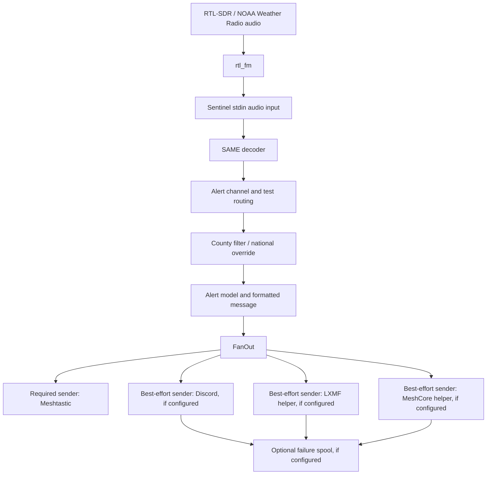

# Project Sentinel

Project Sentinel is an offline-first NOAA SAME/EAS alert relay for resilient emergency communications. It decodes NOAA Weather Radio SAME alerts from an SDR audio stream, applies local routing and county filtering rules, and sends alert text to a Meshtastic mesh as the required primary delivery path.

Sentinel extends the upstream [RCGV1/Meshtastic-SAME-EAS-Alerter](https://github.com/RCGV1/Meshtastic-SAME-EAS-Alerter) project. The upstream project provided the foundation for SAME decoding, county filtering, alert formatting, and Meshtastic CLI delivery. Sentinel preserves that behavior while adding a synchronous sender/fan-out architecture, optional best-effort senders, an optional best-effort failure spool, and manual replay for spooled best-effort failures.

## Mission

Sentinel exists to keep critical alerts moving when normal infrastructure is degraded, overloaded, or unavailable. The current project focuses on local NOAA SAME decoding and mesh-first alert delivery, with optional integrations that must never weaken the primary offline-capable path.

## Current Capabilities

* NOAA SAME/EAS decoding from stdin audio samples.
* SAME county/location filtering with national alert override.
* Test alert routing with optional `--test-channel`.
* Required Meshtastic delivery through the Meshtastic Python CLI.
* Optional Discord webhook delivery.
* Optional Reticulum/LXMF helper delivery.
* Optional MeshCore helper delivery.
* Optional best-effort failure spool for optional sender failures.
* One-shot manual replay of spooled best-effort failures.
* Synchronous sender/fan-out architecture.

Sentinel does not currently include NOAA/NWS API ingestion, a native Reticulum/LXMF protocol implementation, a native MeshCore protocol implementation, scheduler, daemon, async runtime, or background processing.

Sentinel is not a general command/control platform. ATAK integration, GPS tracking, body camera integrations, map or mapping features, asset tracking platforms, team tracking platforms, and unrelated incident command systems are not in scope.

## Architecture Overview



Sentinel separates senders into two groups:

* Required senders must succeed. Meshtastic is currently the only required sender.
* Best-effort senders are optional. Discord, LXMF, and MeshCore are registered only when their required configuration flags are provided.

The optional failure spool is enabled only with `--spool-path <PATH>`. It records failed best-effort sender attempts only. It is not a general alert journal.

Manual replay mode is enabled only with `--replay-spool <PATH>`. It reads an existing spool file and retries configured best-effort senders once, then exits. Meshtastic records are never replayed.

For more detail, see:

* [Architecture](docs/ARCHITECTURE.md)
* [Roadmap](docs/ROADMAP.md)

## Installation

Sentinel currently depends on the same operational inputs as the upstream alerter:

1. Install `rtl_fm`.
   * On Raspberry Pi OS / Raspbian, the upstream guide references these instructions: <https://fuzzthepiguy.tech/rtl_fm-install/>
2. Install the Meshtastic Python CLI.
   * Meshtastic CLI installation: <https://meshtastic.org/docs/software/python/cli/installation/>
3. Build or install Sentinel.

From source:

```sh
cargo build --release
```

The executable name is inherited from the upstream package:

```sh
target/release/Meshtastic-SAME-EAS-Alerter --help
```

Release package names may still use the inherited upstream binary/package naming while Sentinel evolves.

## Usage

Sentinel expects audio from `rtl_fm` on stdin. Tune `rtl_fm` to the nearest NOAA Weather Radio station, typically in the 162.400 MHz to 162.550 MHz range.

```sh
rtl_fm -f <FREQUENCY_IN_HZ> -s 48000 -r 48000 | Meshtastic-SAME-EAS-Alerter
```

The frequency is provided to `rtl_fm` in Hz, not MHz.

### Meshtastic

By default, the Meshtastic CLI attempts to find a connected node via serial or localhost. You can also provide a TCP host or serial port.

```sh
Meshtastic-SAME-EAS-Alerter --host <TCP_HOST:PORT>
Meshtastic-SAME-EAS-Alerter --port <SERIAL_PORT>
```

Alert channel:

```sh
Meshtastic-SAME-EAS-Alerter --alert-channel <CHANNEL_NUMBER>
```

If omitted, alert messages default to channel `0`.

Test channel:

```sh
Meshtastic-SAME-EAS-Alerter --test-channel <CHANNEL_NUMBER>
```

If omitted, test alerts are ignored.

### Sample Rate

The default sample rate is `48000`.

```sh
Meshtastic-SAME-EAS-Alerter --rate <SAMPLE_RATE>
```

Do not change this unless your audio pipeline requires it.

### Location Filtering

Use `--locations` to send only alerts containing specific SAME location codes.

```sh
Meshtastic-SAME-EAS-Alerter --locations 006085,006087
```

If no locations are provided, non-national alerts are allowed. National alerts bypass the location filter. Location codes are listed in [src/sameCodes.csv](src/sameCodes.csv).

### Optional Discord Webhook

Discord delivery is disabled by default. It is enabled only when a webhook URL is provided.

```sh
Meshtastic-SAME-EAS-Alerter --discord-webhook-url <DISCORD_WEBHOOK_URL>
```

Discord is best-effort. Discord failures are logged and do not block Meshtastic delivery. Sentinel does not log the full webhook URL.

### Optional Reticulum/LXMF Helper

LXMF delivery is disabled by default. It is enabled only when both a helper command and destination are provided.

```sh
Meshtastic-SAME-EAS-Alerter --lxmf-command <LXMF_HELPER_PATH> --lxmf-destination <LXMF_DESTINATION>
```

An optional helper configuration path can also be passed:

```sh
Meshtastic-SAME-EAS-Alerter --lxmf-command <LXMF_HELPER_PATH> --lxmf-destination <LXMF_DESTINATION> --lxmf-config <CONFIG_PATH>
```

Sentinel runs the helper as:

```text
<lxmf-command> --destination <destination> [--config <config>]
```

The alert message body is written to the helper over stdin. LXMF is best-effort; failures are logged, may be spooled when `--spool-path` is configured, and do not block Meshtastic delivery.

### Optional MeshCore Helper

MeshCore delivery is disabled by default. It is enabled only when both a helper command and destination are provided.

```sh
Meshtastic-SAME-EAS-Alerter --meshcore-command <MESHCORE_HELPER_PATH> --meshcore-destination <MESHCORE_DESTINATION>
```

An optional helper configuration path can also be passed:

```sh
Meshtastic-SAME-EAS-Alerter --meshcore-command <MESHCORE_HELPER_PATH> --meshcore-destination <MESHCORE_DESTINATION> --meshcore-config <CONFIG_PATH>
```

Sentinel runs the helper as:

```text
<meshcore-command> --destination <destination> [--config <config>]
```

The alert message body is written to the helper over stdin. MeshCore is best-effort; failures are logged, may be spooled when `--spool-path` is configured, and do not block Meshtastic delivery.

### Optional Best-Effort Failure Spool

The failure spool is disabled by default. It is enabled only when a path is provided.

```sh
Meshtastic-SAME-EAS-Alerter --spool-path <PATH>
```

When enabled, Sentinel appends one-line JSONL-style records for failed best-effort sender attempts. Required Meshtastic failures are not spooled. Spool write failures do not block fan-out completion.

### Manual Replay Mode

Manual replay mode retries spooled best-effort failures once and then exits. It is disabled unless `--replay-spool <PATH>` is provided.

```sh
Meshtastic-SAME-EAS-Alerter --replay-spool <SPOOL_PATH> --discord-webhook-url <DISCORD_WEBHOOK_URL>
```

Replay targets only best-effort sender records for `discord`, `lxmf`, and `meshcore`. A matching sender must be configured for a record to be replayed. Meshtastic records are skipped and are never replayed.

Use `--replay-failed-output <PATH>` to write records that still fail during replay:

```sh
Meshtastic-SAME-EAS-Alerter --replay-spool <SPOOL_PATH> --replay-failed-output <FAILED_OUTPUT_PATH> --discord-webhook-url <DISCORD_WEBHOOK_URL>
```

The source spool is read-only during replay. Replay failures are logged and do not stop later records from being attempted.

### Full Examples

Meshtastic only:

```sh
rtl_fm -f <FREQUENCY_IN_HZ> -s 48000 -r 48000 | Meshtastic-SAME-EAS-Alerter --alert-channel 0 --test-channel 1
```

Meshtastic over TCP:

```sh
rtl_fm -f <FREQUENCY_IN_HZ> -s 48000 -r 48000 | Meshtastic-SAME-EAS-Alerter --host <TCP_HOST:PORT> --alert-channel 0
```

Meshtastic with optional Discord and best-effort failure spool:

```sh
rtl_fm -f <FREQUENCY_IN_HZ> -s 48000 -r 48000 | Meshtastic-SAME-EAS-Alerter --alert-channel 0 --discord-webhook-url <DISCORD_WEBHOOK_URL> --spool-path sentinel-failures.jsonl
```

Meshtastic with all current optional best-effort senders:

```sh
rtl_fm -f <FREQUENCY_IN_HZ> -s 48000 -r 48000 | Meshtastic-SAME-EAS-Alerter --alert-channel 0 --discord-webhook-url <DISCORD_WEBHOOK_URL> --lxmf-command <LXMF_HELPER_PATH> --lxmf-destination <LXMF_DESTINATION> --meshcore-command <MESHCORE_HELPER_PATH> --meshcore-destination <MESHCORE_DESTINATION> --spool-path sentinel-failures.jsonl
```

Replay spooled best-effort failures:

```sh
Meshtastic-SAME-EAS-Alerter --replay-spool sentinel-failures.jsonl --replay-failed-output sentinel-replay-failed.jsonl --discord-webhook-url <DISCORD_WEBHOOK_URL>
```

## Legal Disclaimer

Sentinel is not an official emergency alerting system and is not a substitute for NOAA Weather Radio, Wireless Emergency Alerts, Emergency Alert System broadcasts, local emergency management instructions, or other official warning channels.

Use Sentinel at your own risk. Operators are responsible for validating their hardware, radio coverage, alert routing, message delivery, and compliance with applicable laws, regulations, and organizational policies.

This project is neither endorsed by nor supported by Meshtastic. Meshtastic is a registered trademark of Meshtastic LLC. NOAA, NWS, FEMA, EAS, Discord, and other names may be trademarks or service marks of their respective owners.
