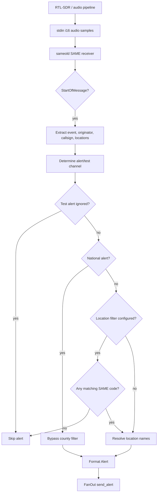
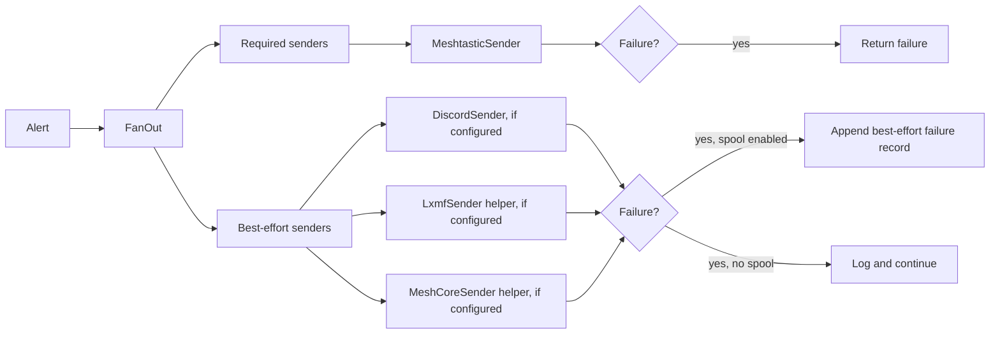
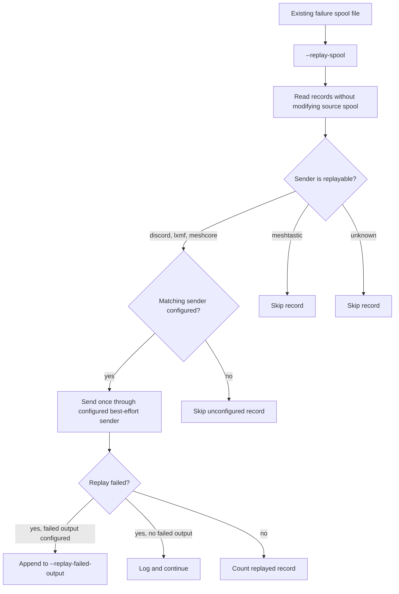

# Sentinel Architecture

## Mission

Sentinel turns NOAA alerts into resilient, operator-focused messages for off-grid and degraded-infrastructure communications. The current system preserves the upstream NOAA Weather Radio/SAME and Meshtastic alerting behavior while extending it into a modular sender architecture with optional best-effort integrations, manual replay for spooled best-effort failures, and local read-only visibility.

## Offline-First Philosophy

Sentinel is designed around the assumption that normal infrastructure may be unreliable or unavailable during emergencies. Local decoding, local filtering, and local mesh delivery remain the core path. Network-dependent integrations are optional and must not weaken the primary offline-capable alert path.

Guiding principles:

* Keep local alert handling usable without cloud services.
* Preserve deterministic alert routing and filtering.
* Treat optional integrations as extensions, not dependencies.
* Prefer synchronous, inspectable behavior until a clear need exists for more complexity.
* Keep failures visible without allowing optional failures to block required delivery.

## Current Alert Flow

Sentinel currently reads SDR audio samples from stdin, decodes SAME/EAS messages, filters alerts, formats a message, and sends it through the configured fan-out.

Normal monitoring mode is the default. Replay mode is a separate one-shot path enabled only with `--replay-spool <PATH>`.

## SAME Decoding Flow

The decoding path remains the upstream-derived behavior:

* Audio is read from stdin as native-endian `i16` samples.
* Samples are converted to `f32`.
* `sameold::SameReceiverBuilder` performs SAME decoding.
* `Message::StartOfMessage` drives alert processing.
* `Message::EndOfMessage` is logged.

This phase does not add NOAA/NWS API ingestion, internet polling, or other alert sources.

## Alert Filtering Flow

Filtering is intentionally conservative and unchanged in spirit from the upstream project:

* Test alerts use `--test-channel` when provided.
* Test alerts are ignored when no test channel is configured.
* Non-test alerts use `--alert-channel`, defaulting to channel `0`.
* National alerts bypass location filtering.
* Non-national alerts are allowed when no location filter is configured.
* When `--locations` is configured, at least one alert SAME location code must match.

## Sender Model

Sentinel uses a synchronous sender model with required and best-effort senders.

Required senders are part of the primary delivery path. If a required sender fails, fan-out returns an error. Best-effort senders are optional; their failures are logged and do not block required delivery.

## Fan-Out Architecture

`FanOut` owns two sender groups:

* Required senders: must succeed for the alert send to be considered successful.
* Best-effort senders: attempted after required senders and allowed to fail.

The current implementation is synchronous. It does not use an async runtime, background worker, retry queue, or parallel dispatcher.

## Meshtastic Role

Meshtastic is the primary and required sender. It remains the default operational path for alert delivery.

Current responsibilities:

* Check Meshtastic readiness with the existing CLI behavior.
* Preserve host and serial port options.
* Preserve message chunking.
* Preserve command construction and retry timing.
* Send alert text to the selected Meshtastic channel.

Meshtastic failures are not spooled in the current implementation.

## Discord Role

Discord is an optional best-effort sender. It is registered only when `--discord-webhook-url` is provided.

Current responsibilities:

* Send the formatted alert message to a Discord webhook.
* Avoid logging the full webhook URL.
* Fail without blocking Meshtastic delivery.

Discord is network-dependent and is not part of Sentinel's offline-first primary path.

## Reticulum/LXMF Role

Reticulum/LXMF is an optional best-effort sender implemented through an external helper command. Sentinel does not implement the native Reticulum or LXMF protocol.

Current responsibilities:

* Register only when both `--lxmf-command` and `--lxmf-destination` are provided.
* Pass the destination and optional `--lxmf-config` path as deterministic command arguments.
* Write the alert message body to the helper over stdin.
* Fail without blocking Meshtastic delivery.

LXMF failures may be spooled when `--spool-path` is configured.

## MeshCore Role

MeshCore is an optional best-effort sender implemented through an external helper command. Sentinel does not implement the native MeshCore protocol.

Current responsibilities:

* Register only when both `--meshcore-command` and `--meshcore-destination` are provided.
* Pass the destination and optional `--meshcore-config` path as deterministic command arguments.
* Write the alert message body to the helper over stdin.
* Fail without blocking Meshtastic delivery.

MeshCore failures may be spooled when `--spool-path` is configured.

## Failure Spool Role

The failure spool is an opt-in durability aid for best-effort sender failures.

Current behavior:

* Disabled by default.
* Enabled only with `--spool-path <PATH>`.
* Appends deterministic one-line JSONL-style records.
* Records failed best-effort sender attempts only.
* Does not spool required Meshtastic failures.
* Spool write failures are logged and do not block fan-out completion.

The spool is not a general alert journal or incident log. It is the input format for manual replay.

## Manual Replay Role

Manual replay is a one-shot operator action for retrying spooled best-effort failures. It is enabled only with `--replay-spool <PATH>` and exits after processing the source file.

Current replay behavior:

* Source spool is read-only.
* Replay targets only `discord`, `lxmf`, and `meshcore`.
* Meshtastic records are skipped and never replayed.
* Matching sender configuration is required.
* Failed replay records can be written to `--replay-failed-output <PATH>`.
* Replay failures do not stop later records.
* There is no retry worker, scheduler, daemon, background thread, or async runtime.

## Failure Spool And Replay Relationship

The failure spool captures best-effort sender failures during normal monitoring when `--spool-path <PATH>` is configured. Manual replay later consumes that file as operator-provided input when `--replay-spool <PATH>` is configured.

These modes are intentionally separate:

* Normal monitoring decodes NOAA SAME/EAS audio and sends new alerts.
* Replay mode retries existing best-effort failure records and then exits.
* `--spool-path` controls failure capture during monitoring.
* `--replay-spool` controls one-shot replay input.
* `--replay-failed-output` optionally captures records that still fail during replay.

## PR Automation

The repository includes a PowerShell PR helper at `scripts/create-pr.ps1`. It validates formatting and tests, pushes the current feature branch to `origin`, and creates or helps create a PR against `hiltonfam/Project-Sentinel:master`.

The script is project safety tooling, not runtime Sentinel behavior. See [PR Workflow](PR_WORKFLOW.md) for details.

## Current Project Boundaries

Sentinel currently includes:

* NOAA SAME/EAS decoding from stdin audio.
* SAME county/location filtering.
* National alert override behavior.
* Test alert routing behavior.
* Synchronous sender/fan-out architecture.
* Required Meshtastic sender.
* Optional Discord webhook sender.
* Optional Reticulum/LXMF helper sender.
* Optional MeshCore helper sender.
* Optional best-effort failure spool.
* One-shot manual replay for spooled best-effort failures.
* Pull request workflow automation.

Sentinel does not currently include:

* NOAA/NWS API ingestion.
* Native Reticulum/LXMF protocol implementation.
* Native MeshCore protocol implementation.
* Background replay workers.
* Command/control actions.
* Map or mapping features.
* GPS tracking.
* Body camera integrations.
* ATAK integration.
* Background processing.
* Async runtime.

## Planned Future Integrations

These are intended evolution points, not current features.

* NOAA/NWS API ingestion: future internet-available alert acquisition path.
* Replay workers: possible future automated processing for retrying spooled best-effort failures.
* Dashboard polish: future read-only operator visibility improvements.
* Release packaging: future Raspberry Pi, Linux, and Windows release hardening.

## Explicit Non-Scope

Sentinel is not a general command/control platform.

The following are not in scope:

* ATAK integration.
* GPS tracking.
* Body camera integrations.
* Map or mapping features.
* Asset tracking platforms.
* Team tracking platforms.
* Unrelated incident command systems.
