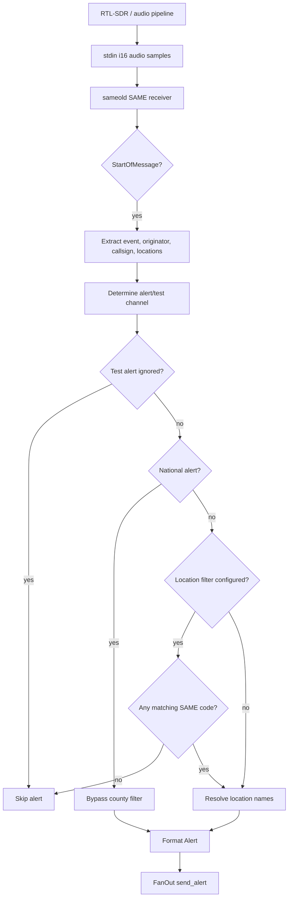
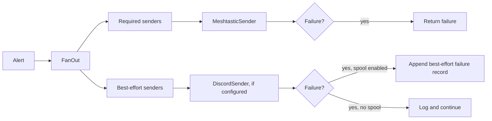

# Sentinel Architecture

## Mission

Sentinel turns NOAA SAME/EAS alerts into resilient, operator-focused messages for off-grid and degraded-infrastructure communications. The current system preserves the upstream Meshtastic alerting behavior while extending it into a modular sender architecture.

## Offline-First Philosophy

Sentinel is designed around the assumption that normal infrastructure may be unreliable or unavailable during emergencies. Local decoding, local filtering, and local mesh delivery remain the core path. Network-dependent integrations are optional and must not weaken the primary offline-capable alert path.

Guiding principles:

* Keep local alert handling usable without cloud services.
* Preserve deterministic alert routing and filtering.
* Treat optional integrations as extensions, not dependencies.
* Prefer synchronous, inspectable behavior until a clear need exists for more complexity.
* Keep failures visible without allowing optional failures to block required delivery.

## Current Alert Flow

Sentinel currently reads SDR audio samples from stdin, decodes SAME/EAS messages, filters alerts, formats a message, and sends it through the configured fan-out.

## SAME Decoding Flow

The decoding path remains the upstream-derived behavior:

* Audio is read from stdin as native-endian `i16` samples.
* Samples are converted to `f32`.
* `sameold::SameReceiverBuilder` performs SAME decoding.
* `Message::StartOfMessage` drives alert processing.
* `Message::EndOfMessage` is logged.

This phase does not add CAP ingestion, internet polling, Skywarn ingestion, or other alert sources.

## Alert Filtering Flow

Filtering is intentionally conservative and unchanged in spirit from the upstream project:

* Test alerts use `--test-channel` when provided.
* Test alerts are ignored when no test channel is configured.
* Non-test alerts use `--alert-channel`, defaulting to channel `0`.
* National alerts bypass location filtering.
* Non-national alerts are allowed when no location filter is configured.
* When `--locations` is configured, at least one alert SAME location code must match.

## Sender Model

Sentinel uses a synchronous sender model with required and best-effort senders.

Required senders are part of the primary delivery path. If a required sender fails, fan-out returns an error. Best-effort senders are optional; their failures are logged and do not block required delivery.

## Fan-Out Architecture

`FanOut` owns two sender groups:

* Required senders: must succeed for the alert send to be considered successful.
* Best-effort senders: attempted after required senders and allowed to fail.

The current implementation is synchronous. It does not use an async runtime, background worker, retry queue, or parallel dispatcher.

## Meshtastic Role

Meshtastic is the primary and required sender. It remains the default operational path for alert delivery.

Current responsibilities:

* Check Meshtastic readiness with the existing CLI behavior.
* Preserve host and serial port options.
* Preserve message chunking.
* Preserve command construction and retry timing.
* Send alert text to the selected Meshtastic channel.

Meshtastic failures are not spooled in the current implementation.

## Discord Role

Discord is an optional best-effort sender. It is registered only when `--discord-webhook-url` is provided.

Current responsibilities:

* Send the formatted alert message to a Discord webhook.
* Avoid logging the full webhook URL.
* Fail without blocking Meshtastic delivery.

Discord is network-dependent and is not part of Sentinel's offline-first primary path.

## Failure Spool Role

The failure spool is an opt-in durability aid for best-effort sender failures.

Current behavior:

* Disabled by default.
* Enabled only with `--spool-path <PATH>`.
* Appends deterministic one-line JSONL-style records.
* Records failed best-effort sender attempts only.
* Does not spool required Meshtastic failures.
* Spool write failures are logged and do not block fan-out completion.

The spool is not currently a replay queue, alert journal, or incident log.

## Current Project Boundaries

Sentinel currently includes:

* NOAA SAME/EAS decoding from stdin audio.
* SAME county/location filtering.
* National alert override behavior.
* Test alert routing behavior.
* Synchronous sender/fan-out architecture.
* Required Meshtastic sender.
* Optional Discord webhook sender.
* Optional best-effort failure spool.

Sentinel does not currently include:

* CAP ingestion.
* Skywarn ingestion.
* Reticulum/LXMF sending.
* MeshCore sending.
* Replay workers.
* Dashboard or incident command UI.
* ATAK interoperability.
* Background processing.
* Async runtime.

## Planned Future Integrations

These are intended evolution points, not current features.

* Reticulum/LXMF: a future optional sender for resilient store-and-forward messaging.
* MeshCore: a future optional sender for MeshCore-compatible networks.
* Replay workers: future processing for retrying spooled best-effort failures.
* Dashboard: a future Incident Command dashboard foundation for operator visibility.
* Skywarn ingestion: a future pipeline for Skywarn-related inputs.
* ATAK: future interoperability for tactical situational awareness workflows.
